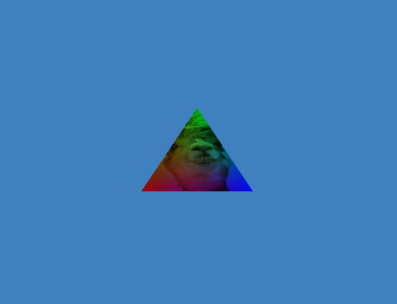

# opengl

Personal library with opengl projects.

* **opengl_window**: barebones template with just a window creation 
* **first_shader_program**: barebones template with window and inline shaders creation
* **triangle**: template with window+shaders+example of triangle drawing via VAO&VBO
* **textures**: triangle with textures, amazing rgb alpaca:\

* **transformations**: Alpaca Cube screen saver :P\


## Requirements
* OpenGL 4.5
* glad 4.5
* glfw3
* cmake
* gcc 12.2.1
* vscode - cmake plugin
* vscode - cmake tools plugin

## Usage
```
git clone https://github.com/RubenMC127/opengl.git
cd opengl
cd triangle
code .
```
After the previous commands, I use VSCode UI to compile and run the project
1. Press the **Build** button, on the bottom powerline. A CLI alternative is:
  ```
  cmake -S . -B build -G "Unix Makefiles"
  ```
2. Press the **Run** button, on the bottom powerline. A CLI alternative is:
  ```
  cmake --build build --config Debug --target my_opengl_project -j 10 --
  build/my_opengl_project
  ```
